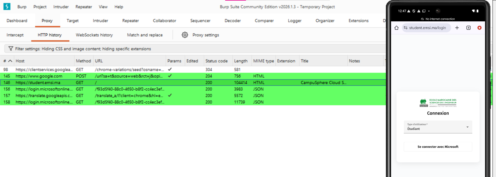

# Observation-du-trafic-HTTP-S-Android-avec-Burp-Suite
## Vue d’ensemble

Ce laboratoire met en place un proxy d’observation entre un Android Emulator et une cible autorisée (https://example.com
) à l’aide de Burp Suite Community Edition.

L’objectif est de comprendre :

Comment un proxy s’insère dans le chemin réseau

Quelles informations sont visibles dans une requête HTTP/HTTPS

Comment produire une documentation claire et reproductible

Ce laboratoire est réalisé dans un environnement isolé et contrôlé.

---

## Environnement de test

Burp Suite Community Edition : v2026.1.3

Android Emulator : Android 10

Adresse IP machine hôte : 192.168.1.17

Port proxy : 8080

Cible autorisée : https://example.com

Date du test : 16/02/2026

Initialisation de Burp Suite

---

# Tableau de bord Burp

Burp Suite est lancé en mode projet temporaire.

Le mode Intercept est initialement désactivé afin d’éviter le blocage du trafic pendant la phase de configuration.

---

# Configuration du Proxy Listener

Un listener est configuré :

Port : 8080

Adresse : Loopback only

----

# Identification de l’adresse IP de la machine hôte

L’adresse IPv4 locale identifiée est :

192.168.1.17

Cette information est essentielle pour assurer la reproductibilité du laboratoire.

----

# Configuration du proxy dans l’Android Emulator

Le proxy est configuré manuellement dans les paramètres Wi-Fi :

Proxy hostname : 10.0.2.2

Proxy port : 8080

Sans cette configuration, le trafic contourne Burp et n’apparaît pas dans l’historique.

----

# Validation de la capture HTTP/HTTPS

Une requête GET vers https://example.com
 apparaît dans l’onglet HTTP history.

Informations observées :

Méthode : GET

Statut : 200 OK

Protocole : HTTP/1.1

Cela confirme que le trafic transite correctement par le proxy.

---

## Analyse détaillée de la requête

Extrait observé :

GET / HTTP/1.1
Host: example.com
User-Agent: Mozilla/5.0 (Linux; Android 10; K) Chrome/133...
Accept: text/html,application/xhtml+xml...
Éléments analysés :

Méthode HTTP : GET

Chemin : /

En-têtes importants

Exemples observés :

User-Agent
Mozilla/5.0 (Linux; Android 10; K) AppleWebKit/537.36 ...

➡️ Indique :

OS : Android 10

Navigateur : Chrome Mobile

Type d’appareil : Mobile

Accept
text/html,application/xhtml+xml,application/xml;q=0.9,image/avif,...

 Types de contenus acceptés par le client.

Accept-Encoding
gzip, deflate, br

 Compression supportée.

Sec-Fetch-* headers
Sec-Fetch-Site: none
Sec-Fetch-Mode: navigate
Sec-Fetch-User: ?1
Sec-Fetch-Dest: document

 Indiquent qu’il s’agit d’une navigation principale vers un document.

## Analyse de la réponse serveur

Informations observées :

HTTP/2 200 OK

Content-Type: text/html

Server: cloudflare

Cf-Cache-Status: HIT

Aucune donnée sensible n’est exposée dans ce cas.

## Vue structurée avec Inspector

Le panneau Inspector permet une lecture structurée :

Attributs de la requête

En-têtes

Indication TLS

Paramètres

Cette vue facilite l’analyse méthodique.

# Interception contrôlée

Le mode Intercept a été activé temporairement afin d’observer :

Le blocage momentané de la requête

Le rôle du proxy comme point de passage

L’interception a ensuite été désactivée pour éviter toute perturbation.

## HTTPS et certificat d’autorité

## Analyse des risques

Dans ce test :

Aucun cookie de session détecté

Aucun paramètre sensible dans l’URL

Utilisation correcte de HTTPS

Risques potentiels dans d’autres applications :

Tokens transmis en URL

Cookies sans attribut Secure ou HttpOnly

Absence d’en-têtes de sécurité

## Recommandations défensives

Imposer HTTPS

Éviter les données sensibles en URL

Configurer correctement les cookies (Secure, HttpOnly, SameSite)

Minimiser les données côté client

Retirer le certificat de laboratoire après test

## Nettoyage

