# Observation-du-trafic-HTTP-S-Android-avec-Burp-Suite
## Vue d’ensemble

Ce laboratoire met en place un proxy d’observation entre un Android Emulator et une cible autorisée (https://example.com
) à l’aide de Burp Suite Community Edition.

L’objectif est de comprendre :

Comment un proxy s’insère dans le chemin réseau

Quelles informations sont visibles dans une requête HTTP/HTTPS

Comment produire une documentation claire et reproductible

Ce laboratoire est réalisé dans un environnement isolé et contrôlé.

---

## Environnement de test

Burp Suite Community Edition : v2026.1.3

Android Emulator : Android 10

Adresse IP machine hôte : 192.168.1.17

Port proxy : 8080

Cible autorisée : https://example.com

Date du test : 16/02/2026

Initialisation de Burp Suite

---

# Tableau de bord Burp

Burp Suite est lancé en mode projet temporaire.

Le mode Intercept est initialement désactivé afin d’éviter le blocage du trafic pendant la phase de configuration.
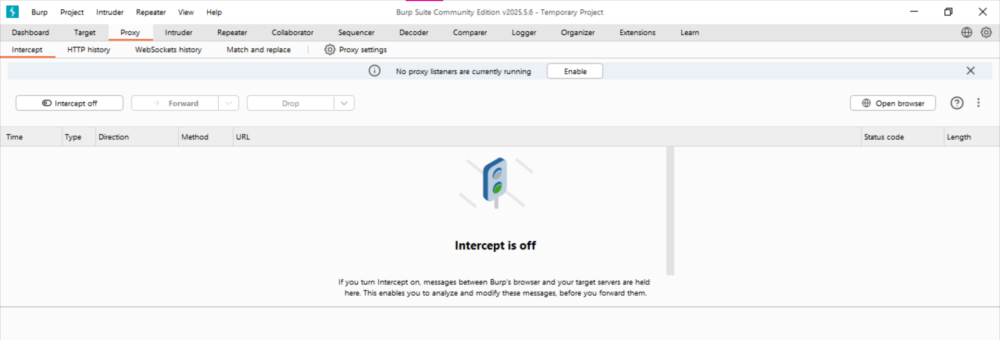

---

# Configuration du Proxy Listener

Un listener est configuré :

Port : 8080

Adresse : Loopback only
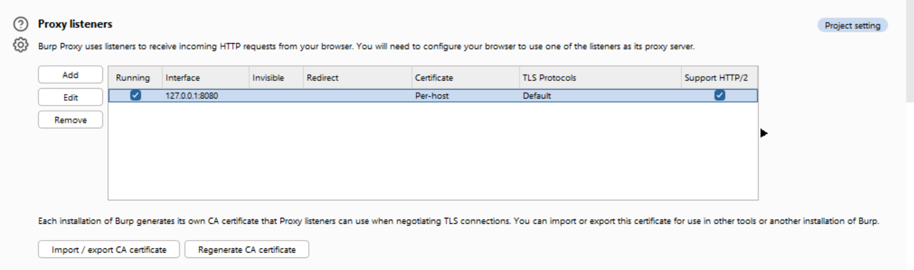

----

# Identification de l’adresse IP de la machine hôte

L’adresse IPv4 locale identifiée est :

192.168.1.17

Cette information est essentielle pour assurer la reproductibilité du laboratoire.
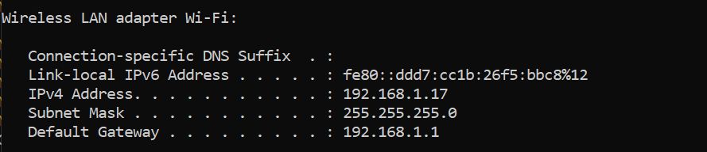

----

# Configuration du proxy dans l’Android Emulator

Le proxy est configuré manuellement dans les paramètres Wi-Fi :

Proxy hostname : 10.0.2.2

Proxy port : 8080

Sans cette configuration, le trafic contourne Burp et n’apparaît pas dans l’historique.
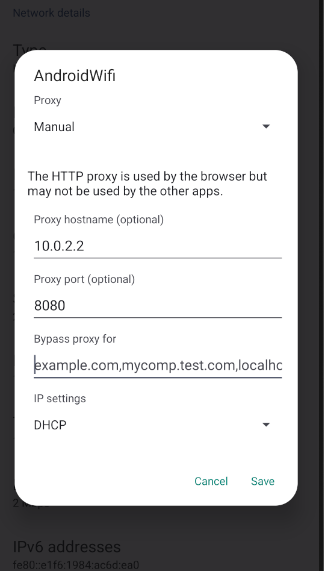

----

# Validation de la capture HTTP/HTTPS

Une requête GET vers https://example.com
 apparaît dans l’onglet HTTP history.
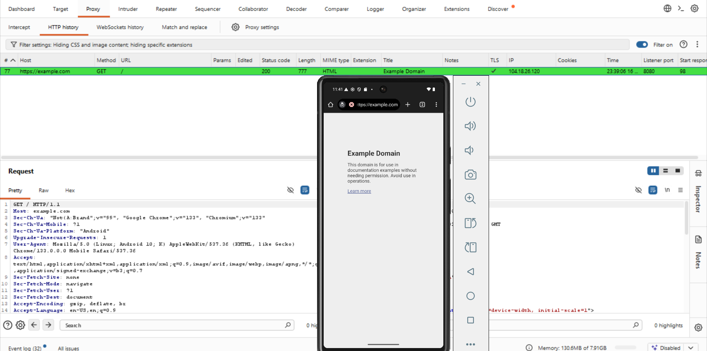

Informations observées :

Méthode : GET

Statut : 200 OK

Protocole : HTTP/1.1


Cela confirme que le trafic transite correctement par le proxy.

---

## Analyse détaillée de la requête

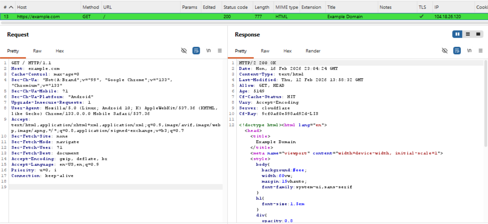

Extrait observé :

GET / HTTP/1.1
Host: example.com
User-Agent: Mozilla/5.0 (Linux; Android 10; K) Chrome/133...
Accept: text/html,application/xhtml+xml...
Éléments analysés :

Méthode HTTP : GET

Chemin : /

En-têtes importants

Exemples observés :

User-Agent
Mozilla/5.0 (Linux; Android 10; K) AppleWebKit/537.36 ...

 Indique :

OS : Android 10

Navigateur : Chrome Mobile

Type d’appareil : Mobile

Accept
text/html,application/xhtml+xml,application/xml;q=0.9,image/avif,...

 Types de contenus acceptés par le client.

Accept-Encoding
gzip, deflate, br

 Compression supportée.

Sec-Fetch-* headers
Sec-Fetch-Site: none
Sec-Fetch-Mode: navigate
Sec-Fetch-User: ?1
Sec-Fetch-Dest: document

 Indiquent qu’il s’agit d’une navigation principale vers un document.


## Analyse de la réponse serveur

Informations observées :

HTTP/2 200 OK

Content-Type: text/html

Server: cloudflare

Cf-Cache-Status: HIT

Aucune donnée sensible n’est exposée dans ce cas.

## Vue structurée avec Inspector

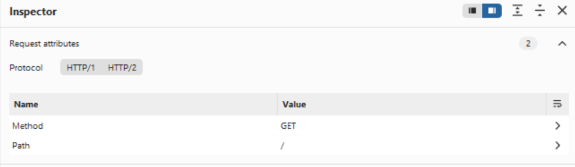
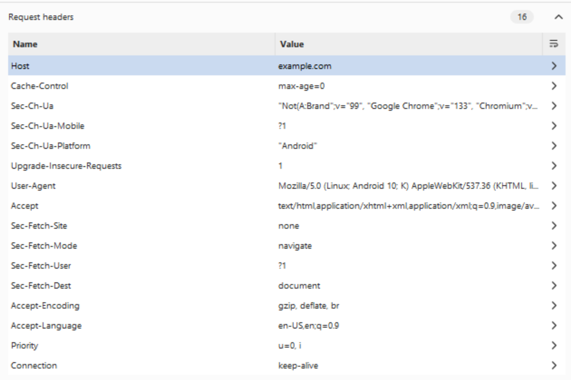
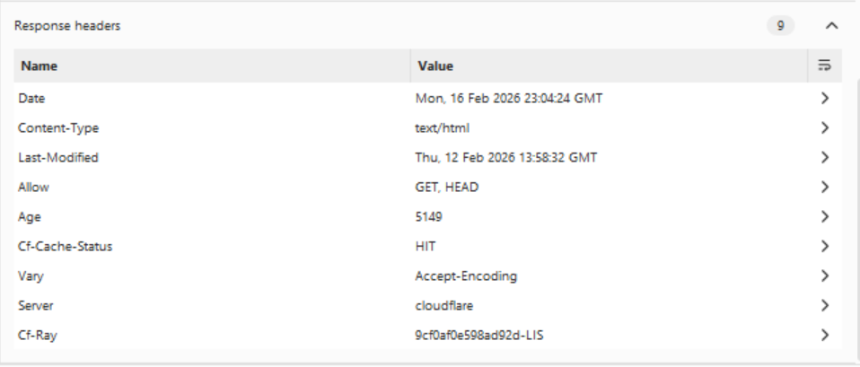
Le panneau Inspector permet une lecture structurée :

Attributs de la requête

En-têtes

Indication TLS

Paramètres

Cette vue facilite l’analyse méthodique.

# Interception contrôlée

Le mode Intercept a été activé temporairement afin d’observer :

Le blocage momentané de la requête

Le rôle du proxy comme point de passage

L’interception a ensuite été désactivée pour éviter toute perturbation.

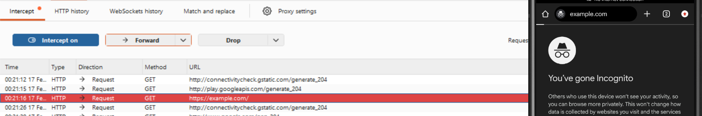

## HTTPS et certificat d’autorité

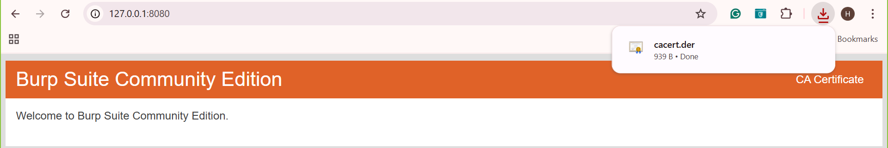
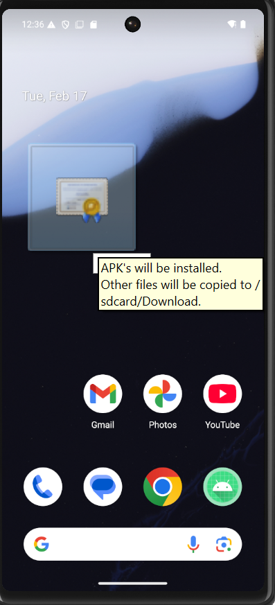
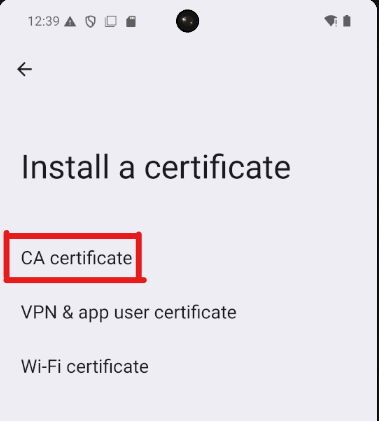
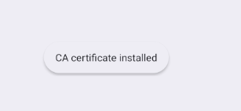

## Analyse des risques


## Périmètre

Test réalisé dans un environnement contrôlé et autorisé :

- Android Emulator (environnement de laboratoire isolé)
- Burp Suite configuré sur la machine hôte
- Cible autorisée : https://demo.owasp-juice.shop
- Aucun compte personnel réel utilisé
- Observation uniquement (aucune modification des requêtes)

---

## Configuration technique

- **Outil** : Burp Suite Community Edition v2026.1.3  
- **IP machine hôte** : 192.168.1.17  
- **Port proxy** : 8080  
- **Configuration proxy Android** :  
  - Proxy hostname : 10.0.2.2  
  - Proxy port : 8080  
- **Mode Intercept** : OFF (utilisé uniquement pour démonstration)
- **Date / Heure du test** : 17/02/2026 — 11:48  

---

## Preuves

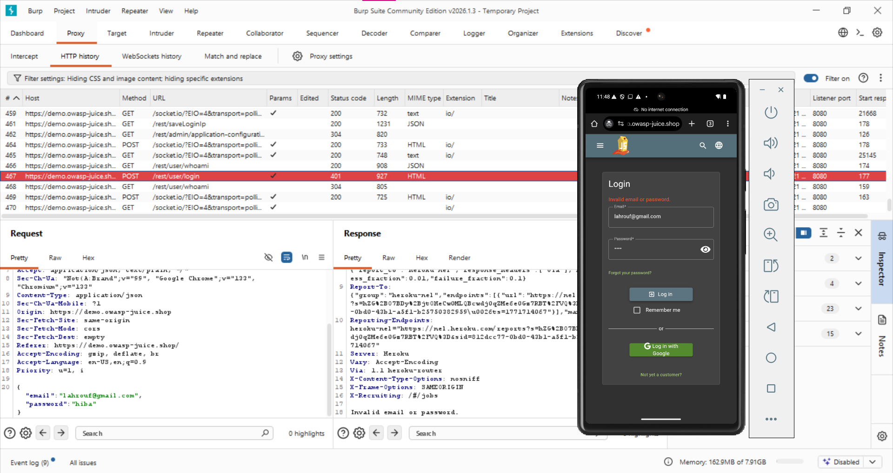

Dans l’onglet **HTTP history**, les requêtes suivantes sont observées :

- `GET /`
- `POST /rest/user/login`

La présence de ces requêtes confirme que le trafic transite bien par le proxy Burp.

---


Requête analysée :

---
POST /rest/user/login HTTP/1.1
Host: demo.owasp-juice.shop
Content-Type: application/json
Origin: https://demo.owasp-juice.shop

User-Agent: Mozilla/5.0 (Linux; Android 10; K) Chrome/133...


Corps de la requête :

```json
{
  "email": "lahrouf@gmail.com",
  "password": "hiba"
}

Réponse serveur observée :

HTTP/1.1 401 Unauthorized
Invalid email or password.
----

## Analyse
🔎 Données observées

Identifiants transmis dans le corps JSON

Aucun paramètre sensible dans l’URL

Communication via HTTPS (TLS actif)

Aucun cookie de session émis lors d’un échec d’authentification

## Risques potentiels (scénario théorique)

Si HTTP était utilisé → interception possible des identifiants

Exposition du mot de passe sur un réseau non sécurisé

Présence potentielle d’un token JWT après authentification réussie

Mauvaise configuration possible des cookies (absence de Secure / HttpOnly)

---

## Recommandations défensives

Forcer HTTPS pour toutes les communications

Implémenter HSTS

Ne jamais transmettre d’identifiants via HTTP

Sécuriser les cookies avec :

Secure

HttpOnly

SameSite

Implémenter le certificate pinning côté Android

Minimiser les données envoyées au client
## Nettoyage
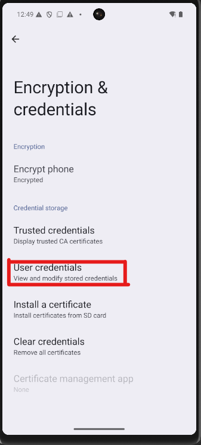
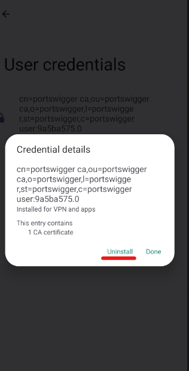
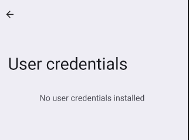
